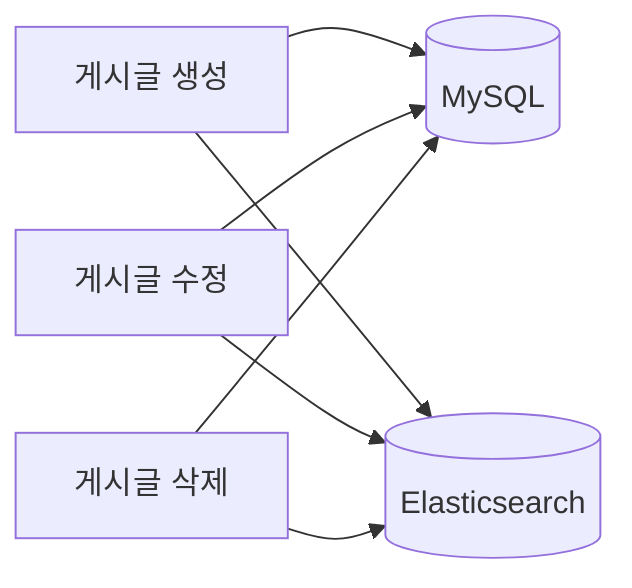

# Mini-Board Elasticsearch 상세 문서

## 1. Elasticsearch 기본 개념

### 1.1 인덱스(Index)
- RDB의 "데이터베이스"에 해당
- 문서(document)의 논리적 컨테이너
- 매핑(mapping)으로 필드 타입 정의

### 1.2 문서(Document)
- JSON 형태의 단일 데이터
- RDB의 "행(row)"에 해당
- 고유 ID로 식별

### 1.3 매핑(Mapping)
- 필드의 데이터 타입과 분석기 설정
- `text`: 전문 검색 (토큰화)
- `keyword`: 정확 일치, 집계
- `long`, `date` 등

### 1.4 분석기(Analyzer)
- 텍스트를 토큰으로 분해
- **토크나이저**: 문자열 분할
- **필터**: 소문자화, 불용어 제거 등

---

## 2. Nori 형태소 분석기

### 2.1 개요
- Elasticsearch의 한국어 분석 플러그인
- 한국어 복합어 분해 지원
- 예: "게시판" → "게시" + "판"

### 2.2 decompound_mode
- `discard`: 복합어 제거
- `mixed`: 분해 + 원형 유지 (권장)
- `none`: 분해 안 함

### 2.3 nori_part_of_speech (선택)
- 품사 태그로 불용어 제거
- Elasticsearch 9.x + nori 플러그인 버전에 따라 stoptags 호환 이슈 가능
- 현재는 nori_tokenizer + lowercase만 사용 (검색 품질에 큰 영향 없음)

---

## 3. Mini-Board 인덱스 설계

### 3.1 인덱스명
`mini-board-posts`

### 3.2 매핑

| 필드 | 타입 | 분석기 | 용도 |
|------|------|--------|------|
| id | long | - | 문서 ID |
| title | text | nori_analyzer | 제목 검색 |
| content | text | nori_analyzer | 본문 검색 |
| tags | text | nori_analyzer | 태그 검색 |
| categoryId | long | - | 필터 |
| categoryName | keyword + text | nori (text 서브필드) | 표시/검색 |
| authorId | long | - | 필터 |
| authorName | keyword | - | 표시 |
| createdAt | date | - | 정렬 |
| updatedAt | date | - | 정렬 |

### 3.3 categoryName multi-field
- `categoryName`: keyword (표시, 필터)
- `categoryName.text`: text + nori (검색)
- "자유"로 "자유게시판" 검색 가능

---

## 4. 검색 쿼리

### 4.1 multi_match
```json
{
  "multi_match": {
    "query": "사용자 입력",
    "fields": ["title^3", "content", "tags^2", "categoryName.text"],
    "type": "best_fields",
    "operator": "or"
  }
}
```
- `^3`, `^2`: 필드별 가중치
- `best_fields`: 가장 매칭되는 필드 기준 스코어

### 4.2 정렬
- `createdAt: desc` (최신순)

---

## 5. 동기화 흐름



- **생성**: DB 저장 후 `indexPost()` 호출
- **수정**: DB 업데이트 후 `updatePost()` 호출
- **삭제**: DB 삭제 후 `deletePost()` 호출
- 비동기 호출, 실패 시 로그만 (`.catch(() => {})`)

---

## 6. 초기화

- 앱 기동 시 `SearchService.onModuleInit()` 실행
- 인덱스 없으면 `ensureIndex()`로 생성
- nori 플러그인 필요 (Dockerfile.elasticsearch에 포함)
