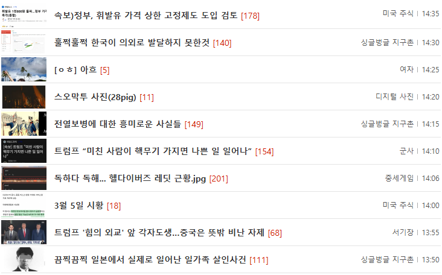

# 게시판 화면설계서

- 프론트엔드
    - 공통
        - 헤더
            - 우측 로그인버튼
                - 로그인을 했을경우에는 사용자 정보, 아닐경우 로그인버튼
            - 중앙
                - 검색 input 및 검색버튼
                    - 전체 카테고리에서 사용자가 입력한 텍스트에 적합한 내용을 검색하여 보여줌
            - 좌측
                - mini-board라는 텍스트를 굵게 표시하고 클릭시 메인화면으로 이동
    - 메인화면
        - 인기글 목록
            - 전체 카테고리에서 조회수가 가장 높은 게시글 30개를 노출
    - 게시판 목록
        - 게시글 목록이 아래 이미지와 비슷하게 왼쪽에는 사용된 이미지중 첫번째, 제목, [댓글수]가가 보임
        

        - 검색,페이징 기능 존재
            - 검색
                - 내용,제목,작성자,날짜
            - 페이징
                - 50개씩 한페이지
        
    - 로그인화면
        - 회원가입
            - 아이디,이름,패스워드,이메일,성별 기입
        - 로그인
            - 아이디,패스워드로 로그인
            - 추후에 구글로그인 추가예정
    - 게시글 등록화면
        - 제목,내용,이미지,테그,카테고리
        - 등록시 자동으로 id값 부여
    - 게시글 상세화면
        - 목록에서 클릭하여 접근 
        - 클릭시 조회수 증가
        - 좋아요
        - 글 작성자가 접근할경우 수정버튼 활성화하여 수정가능
        - 글이 수정된경우에는 수정됨 이라는 UI를 목록화면 및 상세화면에 남김
        - 하단에 댓글을 추가 가능하며, 최대 5댑스 대댓글이 가능하도록 구현 예정
- 백엔드
    - RDB(Mysql)
        - 로그인 정보
        - 게시글
    - 엘라스틱서치
        - 게시글
        - 검색기능
            - 사용자가 입력한 텍스트를 통해 nori형태소 분석기를 이용하여, 제목,내용,테그에 포함되어있는지를 확인하여 사용자에게 노출

- 기타
    - 코드 수정이 완료된 후에는 docs디렉토리에 프론트엔드,백엔드 각각 코드분석이 용이하도록 정리해놓고, 특히 엘라스틱서치쪽을 자세히 명시하고 기본적인 개념부터 상세 개념까지 디테일하게 명시